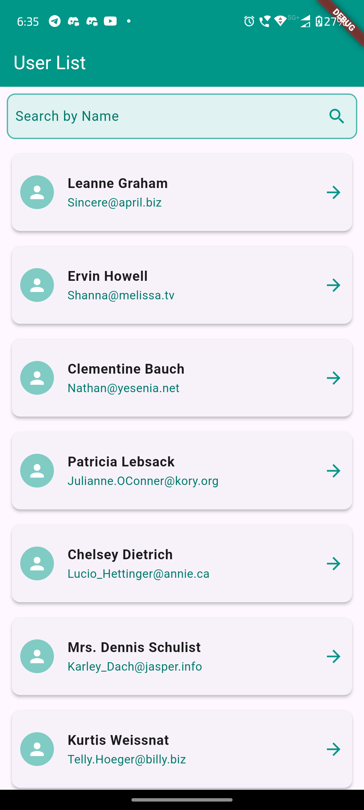
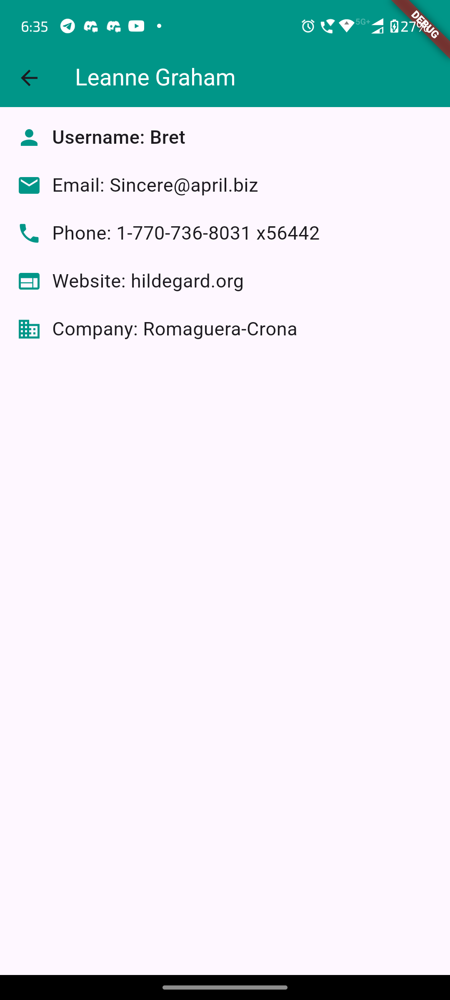
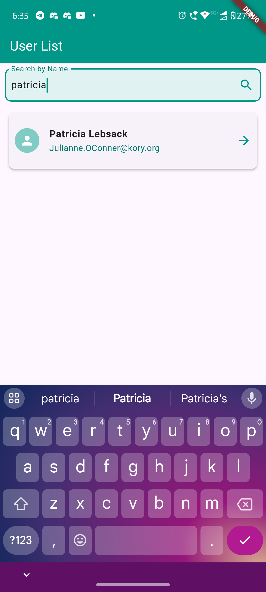

# User List App

## Project Description
The **User List App** is a Flutter application that fetches and displays a list of users from a public API. Users can search for specific names and view detailed information by tapping on any user in the list. This app demonstrates basic Flutter concepts, state management using Provider, and API integration.

## Features
- Display a list of users with their names and email addresses.
- Search functionality to filter users by name.
- Detailed view for each user showing additional information.
- Pull-to-refresh functionality to update the user list.
- Error handling for failed API requests.

## Instructions to Run the App

1. **Clone the Repository**:
   git clone https://github.com/Ankit342/user_list_app.git
   cd user_list_app

2. **Install Dependencies**: Ensure you have Flutter installed on your machine. Run the following command to install the required packages:
   flutter pub get
3. **Run the App**: You can run the app using an emulator or physical device:
   flutter run
   
## Assumptions and Decisions
- The app assumes a stable internet connection is available for fetching user data from the API.
- Used the Provider package for state management to efficiently manage user data.
- Implemented a basic error handling mechanism to notify users of any issues while fetching data.
- The UI was designed keeping in mind material design principles to enhance user experience.

## Screenshots
- **User List Screen**:

- **User Detail Screen**:

- **Search Functionality**:

